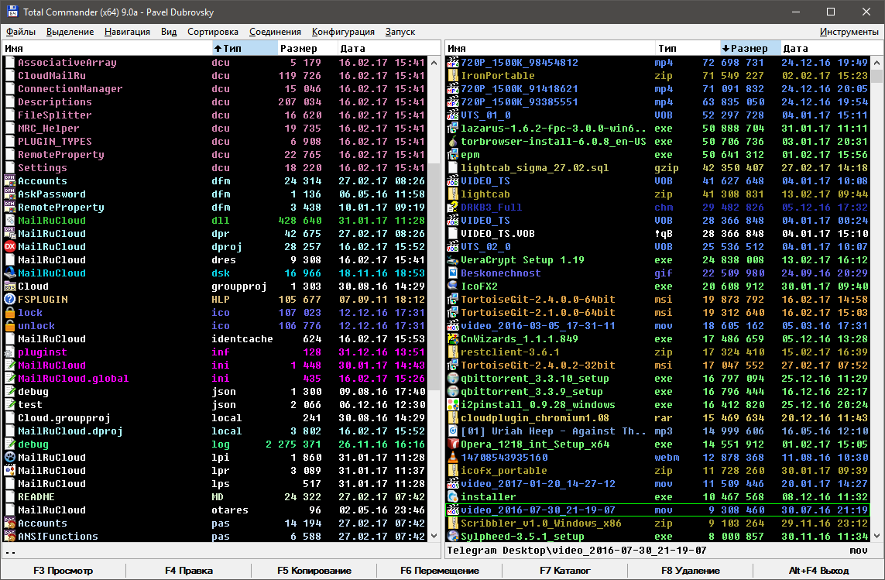

### Total Commander config

Репочка с моим конфигом для Total Commander. Чётко, дерзко, универсально.

### Что к чему

Памятка мне (и использующим) по основным положениям:
- Файл **wincmd.ini** - базовый конфиг, все стандартные секции перенаправлены в **/CONFIG**. Каждый файл соответствует одноимённой секции, или, в случае секций со сходным назначением (например *Shortcuts* и *ShortcutsWin*) - нескольким секциям.
- Каталог **/CONFIG** - собственно, конфиг, разбитый на секции для удобства.
- Некоторые секции (создаваемые для дополнительных полей плагинов, например) не перенаправляются, потому что создаются спонтанно.
- Каталог **/LANGUAGE** - языковые файлы (дистрибутивный перевод интерфейса и команд) + главное меню (дистрибутивное + расширенное, на базе расширенного меню от Константина Власова и Вадима Казакова).
- Все файлы стараемся хранить в кодировке UTF-8.
- Всё на русском, такие дела.

### Шрифты
Схема использует юникодный аналог Fixedsys - [Fixedsys Excelsior](http://www.fixedsysexcelsior.com/), либо его [форк для программистов](https://github.com/kika/fixedsys).

### Цветовая схема

Цветовая схема для файловых панелей, создаваемая и используемая где-то с начала двухтысячных. Основной принцип - быстрая идентификация нужных файлов по цветовой маркировке. Структурно хранится в двух конфигах:
- **Searches.ini** - шаблоны поиска (собственно, создаются и используются в инструменте поиска).
- **Colors.ini** - цветовые параметры, применяемые к этим шаблонам.

Посмотреть, что к чему, можно в самих файлах (формат достаточно нагляден), либо взять конфиг и посмотреть в самом TC.

В шаблонах не используются плагины, всё сделано стандартными средствами TC (в основном, анализ расширений, размеров, редко - путей и содержимого комментариев). Включение схемы может притормаживать TC, но не сильно.

### Горячие клавиши

Всему есть своя горячая клавиша, и она находится в **Shortcuts.ini**. Про формат хоткеев и внутренних команд можно прочесть в справке или в [TCKB](http://tckb.ru/wiki/%D0%93%D0%BE%D1%80%D1%8F%D1%87%D0%B8%D0%B5_%D0%BA%D0%BB%D0%B0%D0%B2%D0%B8%D1%88%D0%B8), например.

Полезняшки навскидку:
- **F1** - развернуть окно (кто пользуется справкой?).
- **F2** - переименовать файл (принудительное перечитывание панелей есть по Ctrl+R).
- **F9** - скопировать в буфер полный путь файла под курсором.
- **Ctrl+O** - открыть консоль.

### Главное меню

Файл **/LANGUAGE/WCMD_RUS_EXT.MNU** - расширенное главное меню, от основного отличается большим набором вынесенных команд и клавиатурных ярылков к ним, а от расширенного, на базе которого создано - уже и не помню чем. Про то, как устроено меню, можно почитать тут: [TCKB](http://tckb.ru/wiki/%D0%A1%D0%B2%D0%BE%D1%91_%D0%BC%D0%B5%D0%BD%D1%8E:_%D1%80%D0%B0%D0%B7%D0%B1%D0%B8%D1%80%D0%B0%D0%B5%D0%BC%D1%81%D1%8F_%D0%B7%D0%B0_%D0%B4%D0%B5%D1%81%D1%8F%D1%82%D1%8C_%D0%BC%D0%B8%D0%BD%D1%83%D1%82).